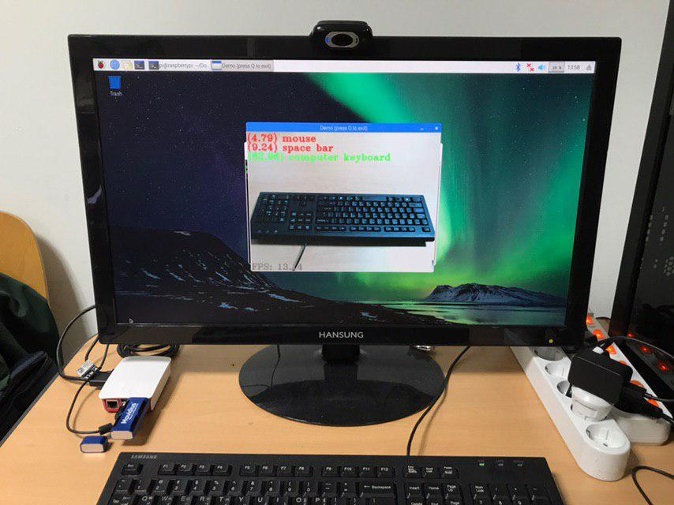

# MobileNetV2

##### pyTorch implementation of MobileNetV2 running on Raspberry PI 3B+ with Intel Movidius Neural Compute Stick

------

This project is the pyTorch version of MobileNetV2 for image classification on ImageNet 2012 dataset. It has been made into a mobile application running on Raspberry Pi 3B+ with Intel Movidius Neural Compute Stick (1st / 2nd generation).

For more details about MobileNetV2, please refer to the original paper:

<u>Sandler, Mark, et al. "Mobilenetv2: Inverted residuals and linear bottlenecks." *Proceedings of the IEEE Conference on Computer Vision and Pattern Recognition*. 2018.</u>

### Requirements

------

##### For running demo application:

- Raspberry Pi 3B+
- Intel Neural Compute Stick 1st or 2nd generation
- USB web camera

##### For training from the scratch:

> - pyTorch 1.0.0
> - Jupyter Notebook
> - Intel OpenVINO toolkit

### Run demo application on RPI3B+

------

1. Install Intel OpenVINO Toolkit for Raspberry Pi
2. Download pre-trained model files from [here](https://drive.google.com/open?id=1utBudlwWfM9QbUnYlDLDNmqp8QGyjwDN), and unzip them into "products" folder
3. Plug both the USB web camera as well as the neural compute stick
4. On terminal run the demo by "python3 <path to the project>/products/prototype.py"

### Train the network from scratch

------

1. Modify the path of ImageNet 2012 dataset in "config.ipynb", if you have saved weight files before, change "save_root" from "None" to "./saves"
2. Start training by running "train.ipynb", it will take approximately 10 days (GTX 1080 TI) to reach 91.4% accuracy @ TOP1.
3. Run "test.ipynb" to test the model with your own image, the script will generate an ONNX model automatically, which will be further converted to Intel OpenVINO model representation through the model optimizer.